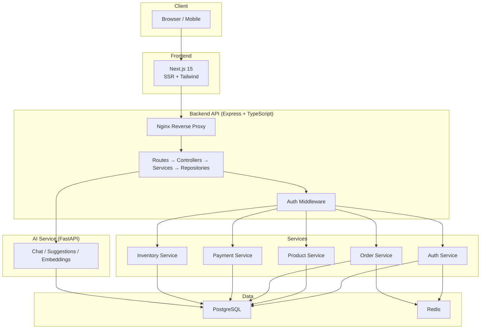
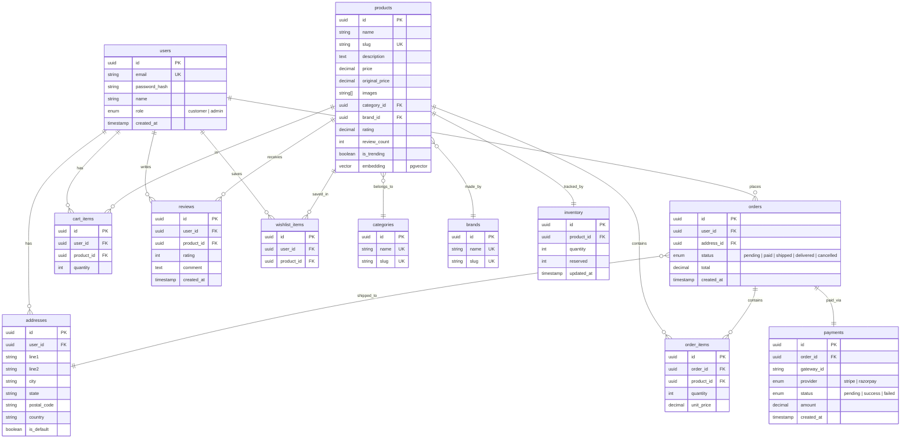

# EStoreFront — Production Roadmap

> Phased plan to evolve the app from dev prototype → production e-commerce platform.

## Architecture Overview



## Database Schema (ER Diagram)



---

## Backend Architecture (Layered)

```
backend/src/
├── config/           # DB, Redis, env validation
├── middleware/        # auth, rateLimiter, errorHandler, validate
├── modules/
│   ├── auth/
│   │   ├── auth.routes.ts
│   │   ├── auth.controller.ts
│   │   ├── auth.service.ts
│   │   └── auth.schema.ts       # Zod validation
│   ├── products/
│   │   ├── products.routes.ts
│   │   ├── products.controller.ts
│   │   ├── products.service.ts
│   │   └── products.schema.ts
│   ├── cart/
│   ├── orders/
│   ├── payments/
│   ├── inventory/
│   ├── reviews/
│   └── admin/
├── lib/              # logger, prisma client, redis client
├── utils/            # helpers, constants
└── index.ts          # app entry
```

---

## Phase 1 — Foundation & Database 🏗️

> Migrate from MongoDB → PostgreSQL, set up layered architecture, add security middleware.

### Deliverables

| Area | What |
|---|---|
| **Database** | PostgreSQL + Prisma ORM, full schema with all tables |
| **Backend structure** | Layered architecture (`modules/`, `middleware/`, `lib/`) |
| **Product module** | Full CRUD with pagination, search, filters |
| **Security** | Helmet, rate limiting, CORS lockdown, input validation (Zod) |
| **Error handling** | Global error handler, structured logging (Pino) |
| **Graceful shutdown** | SIGTERM/SIGINT handlers |
| **Config** | Env validation at startup, `.env.example` files |
| **Seed script** | Product + category + brand seeding for PostgreSQL |

### New Dependencies (Backend)
`prisma`, `@prisma/client`, `helmet`, `express-rate-limit`, `pino`, `pino-http`, `zod`

### Files Changed/Created

- [NEW] `prisma/schema.prisma` — Full database schema
- [NEW] `src/middleware/errorHandler.ts`
- [NEW] `src/middleware/validate.ts`
- [NEW] `src/middleware/rateLimiter.ts`
- [NEW] `src/lib/logger.ts`
- [NEW] `src/lib/prisma.ts`
- [NEW] `src/modules/products/` — controller, service, routes, schema
- [MODIFY] [src/index.ts](file:///c:/Users/Hp/Desktop/Ecommerce_app/backend/src/index.ts) — Helmet, logging, graceful shutdown
- [MODIFY] [package.json](file:///c:/Users/Hp/Desktop/Ecommerce_app/backend/package.json) — New deps
- [DELETE] [src/config/db.ts](file:///c:/Users/Hp/Desktop/Ecommerce_app/backend/src/config/db.ts) — Replaced by Prisma
- [DELETE] [src/routes/products.ts](file:///c:/Users/Hp/Desktop/Ecommerce_app/backend/src/routes/products.ts) — Moved to modules
- [DELETE] [src/data/products.ts](file:///c:/Users/Hp/Desktop/Ecommerce_app/backend/src/data/products.ts) — Replaced by seed script

---

## Phase 2 — Authentication & Authorization 🔐

> JWT auth with refresh tokens, user registration, role-based access control.

### Deliverables

| Area | What |
|---|---|
| **Signup/Login** | Email + password, bcrypt hashing |
| **JWT** | Access token (15 min) + refresh token (7 days) |
| **Roles** | `customer` and `admin` roles |
| **Middleware** | `authenticate` + `authorize("admin")` guards |
| **Password reset** | Token-based reset flow |

### Files Created

- [NEW] `src/modules/auth/` — routes, controller, service, schema
- [NEW] `src/middleware/authenticate.ts`
- [NEW] `src/middleware/authorize.ts`
- [NEW] `src/lib/jwt.ts`

---

## Phase 3 — Cart & Wishlist 🛒

> Persistent cart for users, Redis-backed guest carts, wishlist.

### Deliverables

| Area | What |
|---|---|
| **User cart** | CRUD in PostgreSQL `cart_items` table |
| **Guest cart** | Redis-backed with TTL (merge on login) |
| **Wishlist** | Add/remove/list wishlist items |
| **Redis** | Set up Redis client, session/cart storage |

### New Dependencies
`ioredis`

### Files Created

- [NEW] `src/lib/redis.ts`
- [NEW] `src/modules/cart/` — routes, controller, service, schema
- [NEW] `src/modules/wishlist/` — routes, controller, service, schema

---

## Phase 4 — Orders & Payment 💳

> Full checkout flow with Stripe integration, inventory locking via PostgreSQL transactions.

### Deliverables

| Area | What |
|---|---|
| **Checkout** | Create order → lock inventory → initiate payment |
| **Payment** | Stripe Checkout / Payment Intent |
| **Webhooks** | Stripe webhook signature verification |
| **Inventory** | Transactional stock management (prevent oversell) |
| **Order tracking** | Status updates: pending → paid → shipped → delivered |
| **Addresses** | CRUD for user shipping addresses |

### New Dependencies
`stripe`

### Files Created

- [NEW] `src/modules/orders/` — routes, controller, service, schema
- [NEW] `src/modules/payments/` — routes, controller, service, webhook handler
- [NEW] `src/modules/inventory/` — service (transactional stock queries)
- [NEW] `src/modules/addresses/` — routes, controller, service, schema

### Key Code — Inventory Transaction

```sql
BEGIN;
  SELECT quantity FROM inventory WHERE product_id = $1 FOR UPDATE;
  -- check quantity >= requested
  UPDATE inventory SET quantity = quantity - $2, reserved = reserved + $2 WHERE product_id = $1;
  INSERT INTO orders (...) VALUES (...);
  INSERT INTO order_items (...) VALUES (...);
COMMIT;
```

---

## Phase 5 — Reviews, Search & Admin 🔍

> Product reviews, text search with PostgreSQL tsvector, admin dashboard API.

### Deliverables

| Area | What |
|---|---|
| **Reviews** | Create/list reviews per product, update avg rating |
| **Search** | PostgreSQL full-text search with `tsvector` + GIN index |
| **Admin API** | Product CRUD, order management, inventory dashboard |

### Files Created

- [NEW] `src/modules/reviews/` — routes, controller, service, schema
- [NEW] `src/modules/admin/` — routes, controller, service

---

## Phase 6 — AI Service Migration 🤖

> Migrate AI service from MongoDB → PostgreSQL, use pgvector for embeddings.

### Deliverables

| Area | What |
|---|---|
| **Vector search** | Replace MongoDB vector search with `pgvector` |
| **Async DB** | Use `asyncpg` instead of synchronous `pymongo` |
| **Logging** | Replace print() with `loguru` |
| **Timeouts** | Add request timeout middleware |
| **Config** | Startup validation, `.env.example` |

### Files Changed

- [MODIFY] [config.py](file:///c:/Users/Hp/Desktop/Ecommerce_app/ai-service/config.py) — PostgreSQL connection, validation
- [MODIFY] [services/vector_search.py](file:///c:/Users/Hp/Desktop/Ecommerce_app/ai-service/services/vector_search.py) — pgvector queries
- [MODIFY] [services/chat.py](file:///c:/Users/Hp/Desktop/Ecommerce_app/ai-service/services/chat.py) — Logging
- [MODIFY] [services/suggestions.py](file:///c:/Users/Hp/Desktop/Ecommerce_app/ai-service/services/suggestions.py) — Logging
- [MODIFY] [requirements.txt](file:///c:/Users/Hp/Desktop/Ecommerce_app/ai-service/requirements.txt) — Add `asyncpg`, `loguru`, remove `pymongo`

---

## Phase 7 — Containerization & Deployment 🐳

> Dockerize everything, set up docker-compose for local + production.

### Deliverables

| Area | What |
|---|---|
| **Dockerfiles** | Multi-stage builds for all 3 services |
| **docker-compose** | Frontend, backend, AI, PostgreSQL, Redis |
| **Nginx** | Reverse proxy config |
| **Root files** | [.gitignore](file:///c:/Users/Hp/Desktop/Ecommerce_app/backend/.gitignore), [README.md](file:///c:/Users/Hp/Desktop/Ecommerce_app/Ai_ecommerce/README.md) with architecture docs |

### Files Created

- [NEW] `frontend/Dockerfile`
- [NEW] `backend/Dockerfile`
- [NEW] `ai-service/Dockerfile`
- [NEW] `docker-compose.yml`
- [NEW] `docker-compose.prod.yml`
- [NEW] `nginx/nginx.conf`
- [NEW] [.gitignore](file:///c:/Users/Hp/Desktop/Ecommerce_app/backend/.gitignore)
- [NEW] [README.md](file:///c:/Users/Hp/Desktop/Ecommerce_app/Ai_ecommerce/README.md)

---

## Phase 8 — Observability & CI/CD 📊

> Structured logging, error tracking, monitoring, automated deployment pipeline.

### Deliverables

| Area | What |
|---|---|
| **Logging** | Pino (backend) + Loguru (AI) with JSON format |
| **Error tracking** | Sentry integration (backend + frontend) |
| **Monitoring** | Health check endpoints, uptime alerts |
| **CI/CD** | GitHub Actions: lint → typecheck → test → build → deploy |

### Files Created

- [NEW] `.github/workflows/ci.yml`
- [NEW] `.github/workflows/deploy.yml`

---

## Phase 9 — Performance & Launch Checklist 🚀

> Caching, indexing, CDN, and production hardening.

### Deliverables

| Area | What |
|---|---|
| **Caching** | Redis cache for product listings, popular items |
| **DB indexes** | Products (slug, category), orders (user_id), full-text search |
| **Frontend** | Image optimization, lazy loading, CDN setup |
| **Security audit** | HTTPS, env secrets, SQL injection check, CORS review |

### Launch Checklist

- [ ] HTTPS enabled everywhere
- [ ] Environment variables secured (no [.env](file:///c:/Users/Hp/Desktop/Ecommerce_app/backend/.env) in git)
- [ ] Database backups enabled (daily)
- [ ] Rate limiting active
- [ ] Logs monitored (Sentry + dashboards)
- [ ] Payment webhooks verified
- [ ] Error handling centralized
- [ ] Database indexes verified
- [ ] Load testing completed

---

## Phase Summary

| Phase | Focus | Depends On |
|---|---|---|
| **1** | Foundation + PostgreSQL + Security | — |
| **2** | Auth + JWT + Roles | Phase 1 |
| **3** | Cart + Wishlist + Redis | Phase 2 |
| **4** | Orders + Payment + Inventory | Phase 2, 3 |
| **5** | Reviews + Search + Admin | Phase 2 |
| **6** | AI Service Migration | Phase 1 |
| **7** | Docker + Deployment | Phase 1-6 |
| **8** | Observability + CI/CD | Phase 7 |
| **9** | Performance + Launch | Phase 8 |

> [!IMPORTANT]
> We will implement **one phase at a time**. Each phase will be fully tested before moving to the next. Say **"Start Phase 1"** when you're ready.
